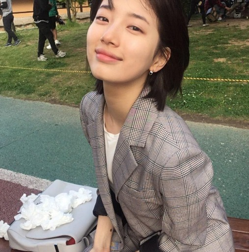
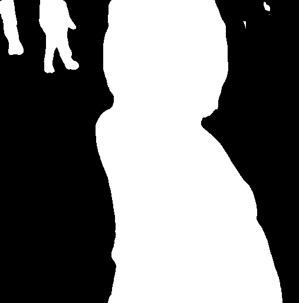
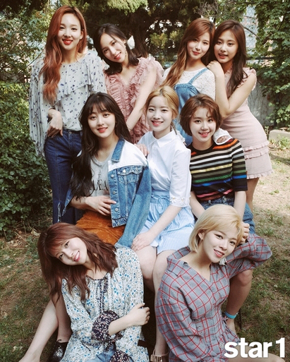
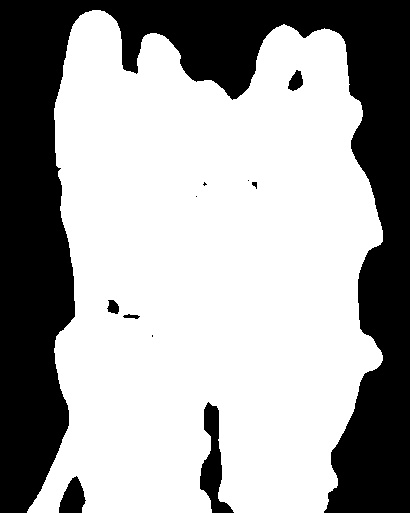
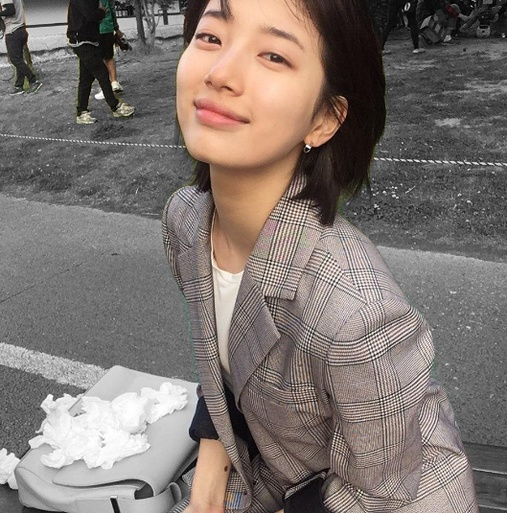
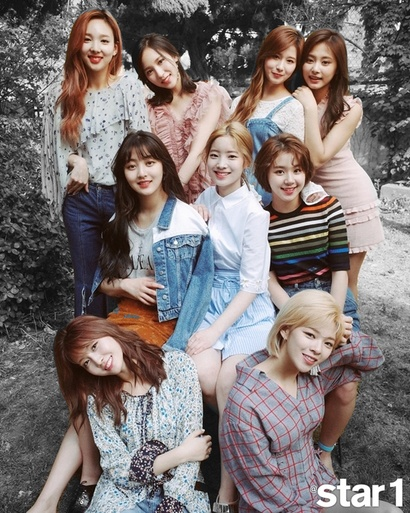
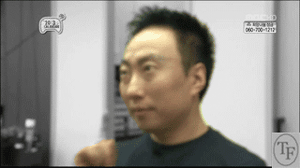
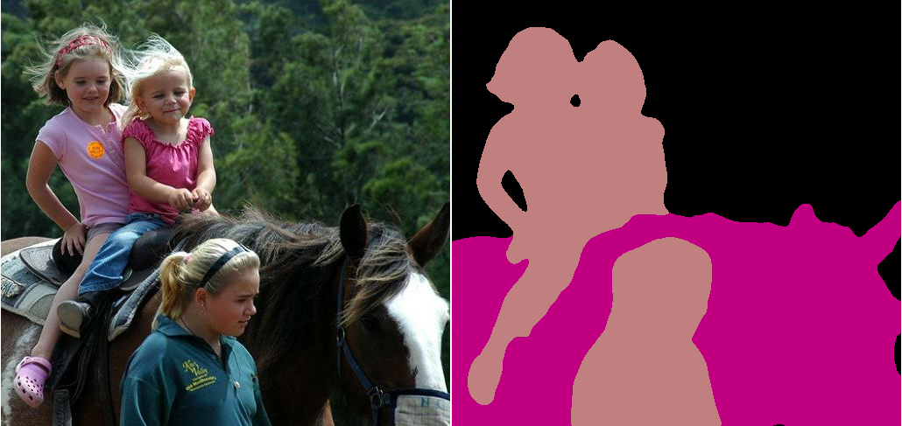

# Proteus-deeplab
 * deeplab's serving version

 * 특이사항  
 batch size: 1 (no batch) we must retrain for batch  
 check point file: no meta files  

## Envirionments

amazon: p3 instance(gpu : v100) - tf-deeplab  

ubuntu: 16.04   
python: 2.7   
cuda: 9.0  
cudnn:7.04 (7.1 error)  
tensorflow: 1.6  (pip install)
serving server: 1.5.0 (tf-deeplab)

serving client: 1.3.0 (tf-mnist)
bazel: 0.5.4 (tensorflow guide)  

tensorflow source install: r1.5  
최신 버전 소스를 설치하면 bazel build 0.10 버전 이상을 요구한다. (serving과 충돌로 인해서 tensorflow 소스 역시 1.5로 다운로드 받아 설치)

## install

```{.bash}

sudo apt-get update upgrade
sudo apt-get install -y vim git build-essential python-setuptools python-numpy python-scipy
sudo apt-get install python-pip python-dev
sudo pip install numpy scipy nltk konlpy
sudo pip install validators
sudo pip install scikit-learn
sudo pip install opencv-python
sudo apt-get install imagemagick libmagickcore-dev libmagickwand-dev libmagic-dev

sudo add-apt-repository -y ppa:webupd8team/java
sudo apt-get update
sudo apt-get -y install oracle-java8-installer

#Cuda Toolkit
#wget cuda
sudo dpkg -i cuda-repo-ubuntu1604-9-0-local_9.0.176-1_amd64.deb
# key update
sudo apt-key adv --fetch-keys http://developer.download.nvidia.com/compute/cuda/repos/ubuntu1604/x86_64/7fa2af80.pub
sudo apt-get update
sudo apt-get install cuda

tar xvfz cudnn-9.0-linux-x64-v7.tgz

sudo cp -P cuda/include/cudnn.h /usr/local/cuda/include
sudo cp -P cuda/lib64/libcudnn* /usr/local/cuda/lib64
sudo chmod a+r /usr/local/cuda/include/cudnn.h /usr/local/cuda/lib64/libcudnn*

echo export LD_LIBRARY_PATH="$LD_LIBRARY_PATH:/usr/local/cuda/lib64:/usr/local/cuda/extras/CUPTI/lib64" >> ~/.bashrc
echo export CUDA_HOME="/usr/local/cuda" >> ~/.bashrc
source /home/ubuntu/.bashrc

sudo pip install --upgrade tensorflow-gpu  

sudo apt-get install pkg-config zip g++ zlib1g-dev unzip python

cat /usr/local/cuda/version.txt
cat /usr/local/cuda/include/cudnn.h | grep CUDNN_MAJOR -A 2

export LD_LIBRARY_PATH=$LD_LIBRARY_PATH:/usr/local/cuda/extras/CUPTI/lib64

sudo pip install glances
sudo pip install nvidia-ml-py
sudo glances

#for quantization & optimization
git clone -b r1.5 --recurse-submodules https://github.com/tensorflow/tensorflow.git
cd tensorflow
./configure
bazel build --config=opt --config=cuda //tensorflow/tools/pip_package:build_pip_package

```

## cityscape

```{.bash}

curl -H 'Cookie: PHPSESSID=bjvhb6j3q51a8nddp911k05va5' -L -o leftImg8bit_trainvaltest.zip 'https://www.cityscapes-dataset.com/file-handling/?packageID=3'


```


## tensorflow

* jupyter notebook execute  
http://52.91.179.35:8888/notebooks/deeplab_demo.ipynb

* python inference.py

## serving client

* install

```{.bash}
#pip install tensorflow-serving-api

bazel build //tensorflow_serving/example:deeplab_client
```

* client execute  

```{.bash}

bazel-bin/tensorflow_serving/example/deeplab_client --server=10.0.2.126:9000 --image=/home/ubuntu/serving/image.jpg --model=deeplab --output_dir=deeplab

```


## serving server

* saved model  
python saved_model.py

```{.python}

builder = saved_model_builder.SavedModelBuilder(export_path)

tensor_info_x = utils.build_tensor_info(x)
tensor_info_y = utils.build_tensor_info(y)

prediction_signature = signature_def_utils.build_signature_def(
        inputs={'img': tensor_info_x},
        outputs={'seg': tensor_info_y},
        method_name=signature_constants.PREDICT_METHOD_NAME)

legacy_init_op = tf.group(tf.tables_initializer(), name='legacy_init_op')
builder.add_meta_graph_and_variables(
        sess, [tag_constants.SERVING],
        signature_def_map={
          'predict_seg': prediction_signature,
        },
        legacy_init_op=legacy_init_op)

builder.save()

```

* install
```{.bash}

sudo apt-get install pkg-config zip g++ zlib1g-dev unzip python
wget https://github.com/bazelbuild/bazel/releases/download/0.5.4/bazel-0.5.4-installer-linux-x86_64.sh
chmod +x bazel-<version>-installer-linux-x86_64.sh
./bazel-<version>-installer-linux-x86_64.sh --user
export PATH="$PATH:$HOME/bin"

sudo apt-get update && sudo apt-get install -y \
        build-essential \
        curl \
        libcurl3-dev \
        git \
        libfreetype6-dev \
        libpng12-dev \
        libzmq3-dev \
        pkg-config \
        python-dev \
        python-numpy \
        python-pip \
        software-properties-common \
        swig \
        zip \
        zlib1g-dev

git clone --recurse-submodules https://github.com/tensorflow/serving
cd serving

git clone -b 1.5.0 --recurse https://github.com/tensorflow/serving.git serving
cd serving
cd tensorflow
git tag
git checkout v1.5.0
git log

# serving compile
#bazel build -c opt tensorflow_serving/...
#bazel-bin/tensorflow_serving/model_servers/tensorflow_model_server
#bazel test -c opt tensorflow_serving/...

./compile_tensorflow_serving.sh

```

* execute

```{.bash}

bazel-bin/tensorflow_serving/model_servers/tensorflow_model_server --port=9000 --model_name=deeplab --model_base_path=/home/ubuntu/model

```

## serving result

* input:  

  

* output: 

 

## training

```{.bash}

python train.py \
    --logtostderr \
    --train_split="train" \
    --model_variant="xception_65" \
    --atrous_rates=6 \
    --atrous_rates=12 \
    --atrous_rates=18 \
    --output_stride=16 \
    --decoder_output_stride=4 \
    --train_crop_size=513 \
    --train_crop_size=513 \
    --train_batch_size=1 \
    --tf_initial_checkpoint="model/xception/model.ckpt.index" \
    --train_logdir="train_model" \
    --dataset_dir="datasets/pascal_voc_seg/tfrecord"

tensorboard --logdir=train_model --host 0.0.0.0 --port 6006

```

* tensor names / not match freezing graph

```{.python}

with tf.Session(config=tf.ConfigProto(allow_soft_placement=True)) as sess:
        #new_saver = tf.train.import_meta_graph('model/deeplabv3_pascal_trainval/model.ckpt.meta')
        #new_saver.restore(sess, 'model/deeplabv3_pascal_trainval/model.ckpt')
        new_saver = tf.train.import_meta_graph('train/model.ckpt-15021.meta')
        new_saver.restore(sess, 'train/model.ckpt-15021')
        g = tf.get_default_graph()

        for op in g.get_operations():
                print(op.name)
```

## freezing

```{.bash}

# You must set same training parameter.
  
python export_model.py \
  --checkpoint_path="train/model.ckpt-30000" \
  --atrous_rates=6 \
  --atrous_rates=12 \
  --atrous_rates=18 \
  --output_stride=16 \
  --export_path="train/frozen_model.pb"

```

## optimization

```{.bash}

bazel build --config=opt --config=cuda //tensorflow/python/tools:optimize_for_inference

bazel-bin/tensorflow/python/tools/optimize_for_inference \
  --input=/home/ubuntu/proteus-deeplab/model/deeplabv3_pascal_trainval/frozen_inference_graph.pb \
  --output=/home/ubuntu/proteus-deeplab/model/deeplabv3_pascal_trainval/optimize_model.pb \  
  --input_names="ImageTensor" \
  --output_names="SemanticPredictions"
  
```

## quantization 

I figured out the source of the error. I was using tf.identity ops to name my output tensors. The call to graph_util.remove_training_nodes on line 413 in quantize_graph.py removes all identity ops from the graph causing a KeyError. Apparently,  

vi tensorflow/tools/quantization/quantize_graph.py  

```{.python}

self.set_input_graph(graph_util.remove_training_nodes(self.input_graph)) to 
self.set_input_graph(self.input_graph)

```

```{.bash}

bazel build --config=opt --config=cuda //tensorflow/tools/quantization:quantize_graph

bazel-bin/tensorflow/tools/quantization/quantize_graph \
  --input=/home/ubuntu/proteus-deeplab/model/deeplabv3_pascal_trainval/optimize_model.pb \
  --output=/home/ubuntu/proteus-deeplab/model/deeplabv3_pascal_trainval/eight_model.pb \
  --output_node_names="SemanticPredictions" \
  --mode=eightbit

  File "/home/ubuntu/tensorflow/bazel-bin/tensorflow/tools/quantization/quantize_graph.runfiles/org_tensorflow/tensorflow/python/framework/importer.py", line 648, in import_graph_def
    node, 'Input tensor %r %s' % (input_name, te)))
ValueError: graph_def is invalid at node u'Shape': Input tensor 'ImageTensor:0' Cannot convert a tensor of type float32 to an input of type uint8

```

* This quantize_graph tool is outdated. You may try the new transform_graph tool:  
https://github.com/tensorflow/tensorflow/tree/master/tensorflow/tools/graph_transforms#eight-bit-calculations  

```{.bash}

bazel build --config=opt --config=cuda tensorflow/tools/graph_transforms:transform_graph

bazel-bin/tensorflow/tools/graph_transforms/transform_graph \
--in_graph=/home/ubuntu/proteus-deeplab/model/deeplabv3_pascal_trainval/optimize_model.pb \
--out_graph=/home/ubuntu/proteus-deeplab/model/deeplabv3_pascal_trainval/eight_model.pb \
--inputs='ImageTensor:0' --outputs='SemanticPredictions:0' \
--transforms='
  add_default_attributes
  strip_unused_nodes(type=float, shape="1,299,299,3")
  remove_nodes(op=Identity, op=CheckNumerics)
  fold_constants(ignore_errors=true)
  fold_batch_norms
  fold_old_batch_norms
  quantize_weights
  quantize_nodes
  strip_unused_nodes
  sort_by_execution_order'

```

## Application Example:

### BG: Blur

    

     

### BG: Gray

  

   

### GIF

  

   

## DeepLab: Deep Labelling for Semantic Image Segmentation

DeepLab is a state-of-art deep learning model for semantic image segmentation,
where the goal is to assign semantic labels (e.g., person, dog, cat and so on)
to every pixel in the input image. Current implementation includes the following
features:

1.  DeepLabv1 [1]: We use *atrous convolution* to explicitly control the
    resolution at which feature responses are computed within Deep Convolutional
    Neural Networks.

2.  DeepLabv2 [2]: We use *atrous spatial pyramid pooling* (ASPP) to robustly
    segment objects at multiple scales with filters at multiple sampling rates
    and effective fields-of-views.

3.  DeepLabv3 [3]: We augment the ASPP module with *image-level feature* [5, 6]
    to capture longer range information. We also include *batch normalization*
    [7] parameters to facilitate the training. In particular, we applying atrous
    convolution to extract output features at different output strides during
    training and evaluation, which efficiently enables training BN at output
    stride = 16 and attains a high performance at output stride = 8 during
    evaluation.

4.  DeepLabv3+ [4]: We extend DeepLabv3 to include a simple yet effective
    decoder module to refine the segmentation results especially along object
    boundaries. Furthermore, in this encoder-decoder structure one can
    arbitrarily control the resolution of extracted encoder features by atrous
    convolution to trade-off precision and runtime.

If you find the code useful for your research, please consider citing our latest
work:

```
@article{deeplabv3plus2018,
  title={Encoder-Decoder with Atrous Separable Convolution for Semantic Image Segmentation},
  author={Liang-Chieh Chen and Yukun Zhu and George Papandreou and Florian Schroff and Hartwig Adam},
  journal={arXiv:1802.02611},
  year={2018}
}
```

In the current implementation, we support adopting the following network
backbones:

1.  MobileNetv2 [8]: A fast network structure designed for mobile devices. **We
    will provide MobileNetv2 support in the next update. Please stay tuned.**

2.  Xception [9, 10]: A powerful network structure intended for server-side
    deployment.

This directory contains our TensorFlow [11] implementation. We provide codes
allowing users to train the model, evaluate results in terms of mIOU (mean
intersection-over-union), and visualize segmentation results. We use PASCAL VOC
2012 [12] and Cityscapes [13] semantic segmentation benchmarks as an example in
the code.

Some segmentation results on Flickr images:
<p align="center">
    </br>
    </br>
    </br>
</p>

### Contacts (Maintainers)

*   Liang-Chieh Chen, github: [aquariusjay](https://github.com/aquariusjay)
*   YuKun Zhu, github: [yknzhu](https://github.com/YknZhu)
*   George Papandreou, github: [gpapan](https://github.com/gpapan)

### Tables of Contents

Demo:

*   <a href='deeplab_demo.ipynb'>Jupyter notebook for off-the-shelf inference.</a><br>

Running:

*   <a href='g3doc/installation.md'>Installation.</a><br>
*   <a href='g3doc/pascal.md'>Running DeepLab on PASCAL VOC 2012 semantic segmentation dataset.</a><br>
*   <a href='g3doc/cityscapes.md'>Running DeepLab on Cityscapes semantic segmentation dataset.</a><br>

Models:

*   <a href='g3doc/model_zoo.md'>Checkpoints and frozen inference graphs.</a><br>

Misc:

*   Please check <a href='g3doc/faq.md'>FAQ</a> if you have some questions before reporting the issues.<br>

### Getting Help

To get help with issues you may encounter while using the DeepLab Tensorflow
implementation, create a new question on
[StackOverflow](https://stackoverflow.com/) with the tags "tensorflow" and
"deeplab".

Please report bugs (i.e., broken code, not usage questions) to the
tensorflow/models GitHub [issue
tracker](https://github.com/tensorflow/models/issues), prefixing the issue name
with "deeplab".

### References

1.  **Semantic Image Segmentation with Deep Convolutional Nets and Fully Connected CRFs**<br />
    Liang-Chieh Chen+, George Papandreou+, Iasonas Kokkinos, Kevin Murphy, Alan L. Yuille (+ equal
    contribution). <br />
    [[link]](https://arxiv.org/abs/1412.7062). In ICLR, 2015.

2.  **DeepLab: Semantic Image Segmentation with Deep Convolutional Nets,**
    **Atrous Convolution, and Fully Connected CRFs** <br />
    Liang-Chieh Chen+, George Papandreou+, Iasonas Kokkinos, Kevin Murphy, and Alan L Yuille (+ equal
    contribution). <br />
    [[link]](http://arxiv.org/abs/1606.00915). TPAMI 2017.

3.  **Rethinking Atrous Convolution for Semantic Image Segmentation**<br />
    Liang-Chieh Chen, George Papandreou, Florian Schroff, Hartwig Adam.<br />
    [[link]](http://arxiv.org/abs/1706.05587). arXiv: 1706.05587, 2017.

4.  **Encoder-Decoder with Atrous Separable Convolution for Semantic Image Segmentation**<br />
    Liang-Chieh Chen, Yukun Zhu, George Papandreou, Florian Schroff, Hartwig Adam. arXiv: 1802.02611.<br />
    [[link]](https://arxiv.org/abs/1802.02611). arXiv: 1802.02611, 2018.

5.  **ParseNet: Looking Wider to See Better**<br />
    Wei Liu, Andrew Rabinovich, Alexander C Berg<br />
    [[link]](https://arxiv.org/abs/1506.04579). arXiv:1506.04579, 2015.

6.  **Pyramid Scene Parsing Network**<br />
    Hengshuang Zhao, Jianping Shi, Xiaojuan Qi, Xiaogang Wang, Jiaya Jia<br />
    [[link]](https://arxiv.org/abs/1612.01105). In CVPR, 2017.

7.  **Batch Normalization: Accelerating Deep Network Training by Reducing Internal Covariate shift**<br />
    Sergey Ioffe, Christian Szegedy <br />
    [[link]](https://arxiv.org/abs/1502.03167). In ICML, 2015.

8.  **Inverted Residuals and Linear Bottlenecks: Mobile Networks for Classification, Detection and Segmentation**<br />
    Mark Sandler, Andrew Howard, Menglong Zhu, Andrey Zhmoginov, Liang-Chieh Chen<br />
    [[link]](https://arxiv.org/abs/1801.04381). arXiv:1801.04381, 2018.

9.  **Xception: Deep Learning with Depthwise Separable Convolutions**<br />
    François Chollet<br />
    [[link]](https://arxiv.org/abs/1610.02357). In CVPR, 2017.

10. **Deformable Convolutional Networks -- COCO Detection and Segmentation Challenge 2017 Entry**<br />
    Haozhi Qi, Zheng Zhang, Bin Xiao, Han Hu, Bowen Cheng, Yichen Wei, Jifeng Dai<br />
    [[link]](http://presentations.cocodataset.org/COCO17-Detect-MSRA.pdf). ICCV COCO Challenge
    Workshop, 2017.

11. **Tensorflow: Large-Scale Machine Learning on Heterogeneous Distributed Systems**<br />
    M. Abadi, A. Agarwal, et al. <br />
    [[link]](https://arxiv.org/abs/1603.04467). arXiv:1603.04467, 2016.

12. **The Pascal Visual Object Classes Challenge – A Retrospective,** <br />
    Mark Everingham, S. M. Ali Eslami, Luc Van Gool, Christopher K. I. Williams, John
    Winn, and Andrew Zisserma. <br />
    [[link]](http://host.robots.ox.ac.uk/pascal/VOC/voc2012/). IJCV, 2014.

13. **The Cityscapes Dataset for Semantic Urban Scene Understanding**<br />
    Cordts, Marius, Mohamed Omran, Sebastian Ramos, Timo Rehfeld, Markus Enzweiler, Rodrigo Benenson, Uwe Franke, Stefan Roth, Bernt Schiele. <br />
    [[link]](https://www.cityscapes-dataset.com/). In CVPR, 2016.
